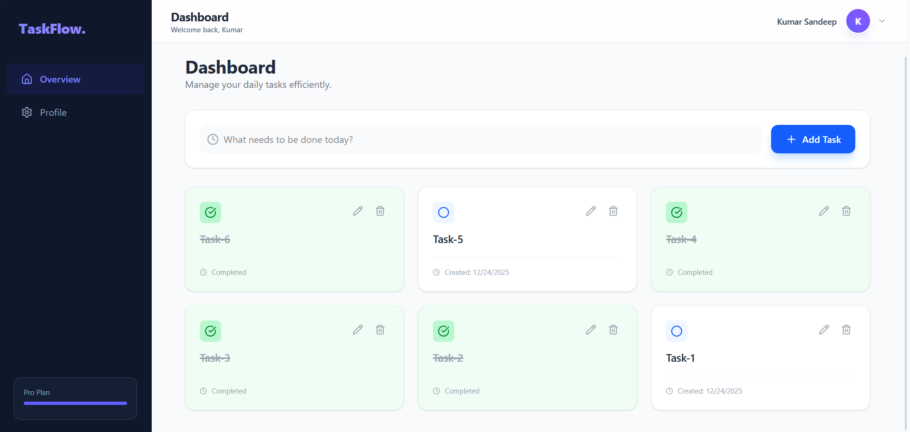
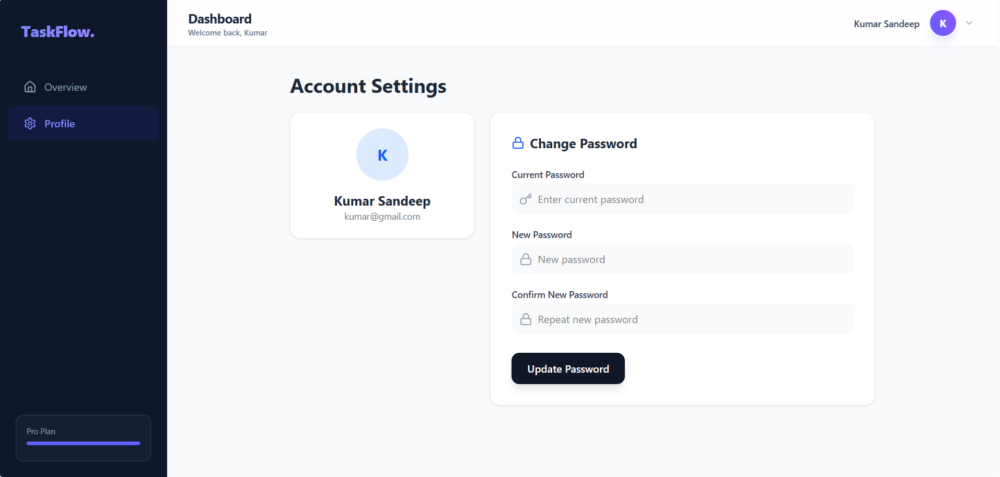
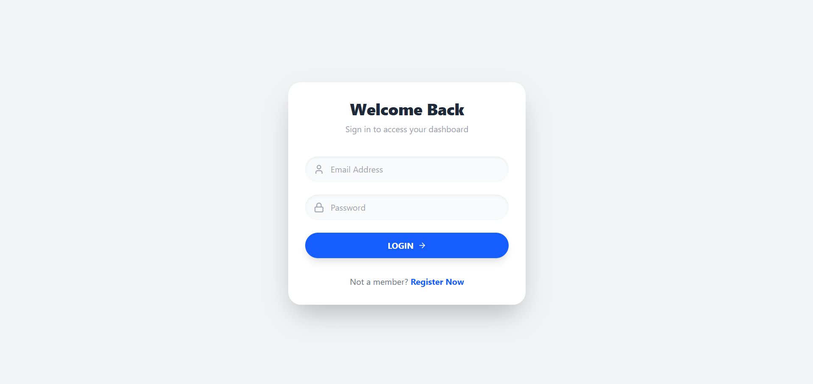

Auth & Dashboard App - MERN Stack Assessment

A modern, scalable Full Stack MERN application featuring secure authentication, a glassmorphism dashboard, and robust task management. Built as part of the Frontend Developer Intern assessment.

📸 Screenshots

🛠️ Tech Stack

Domain

Technologies

Frontend

React (Vite), TailwindCSS, Lucide React, Axios, React Hot Toast

Backend

Node.js, Express.js, JWT, Bcrypt, Mongoose

Database

MongoDB Atlas

Tooling

Postman, Git, VS Code

✨ Key Features

Modern UI/UX: Responsive Sidebar, "Glassmorphism" design, and custom scrollbars.

Secure Authentication:

Register/Login with JWT.

Strong password validation (Regex).

Server-side validation using express-validator.

Task Management (CRUD):

Create, Read, Update, Delete tasks.

Optimistic UI Updates (Instant feedback without waiting for server).

Mark tasks as completed/active.

Profile System: Secure password update functionality.

⚙️ Installation & Setup

Follow these steps to run the project locally.

Prerequisites

Node.js installed

MongoDB Atlas account (Connection String)

1. Backend Setup

# 1. Navigate to server
cd server

# 2. Install dependencies
npm install

# 3. Environment Variables
# Create a .env file in the /server directory and add:
# MONGO_URI=your_mongodb_connection_string
# JWT_SECRET=your_secret_key
# PORT=5000
# (You can check .env.example for reference)

# 4. Start Server
npm start
or npm run dev

2. Frontend Setup

# 1. Navigate to client
cd client

# 2. Install dependencies
npm install

# 3. Start React Dev Server
npm run dev

3. Access the App

Open your browser and navigate to:
http://localhost:5173

📂 Project Structure

/client   -> Frontend (React + Vite)
  /src
    /components  -> Reusable UI & Layouts
    /context     -> Global Auth State
    /pages       -> Views (Login, Dashboard)
    
/server   -> Backend (Node + Express)
  /controllers   -> Business Logic
  /models        -> Database Schemas
  /routes        -> API Endpoints
  /middleware    -> Auth & Error Handling

Author: Sandeep Kumar